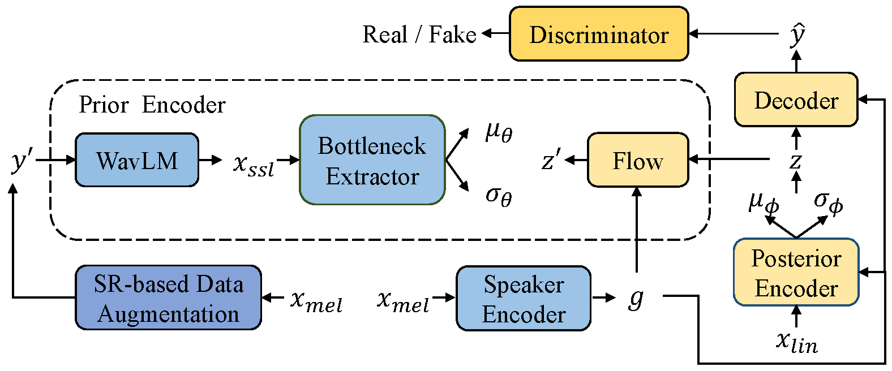
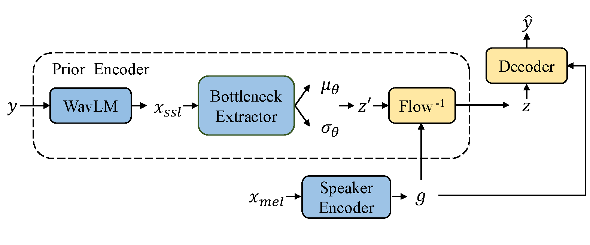

# FreeVC: Towards High-Quality Text-Free One-Shot Voice Conversion

[](https://arxiv.org/abs/2210.15418)
[](https://olawod.github.io/FreeVC-demo/)


In this [paper](https://arxiv.org/abs/2210.15418), we adopt the end-to-end framework of [VITS](https://arxiv.org/abs/2106.06103) for high-quality waveform reconstruction, and propose strategies for clean content information extraction without text annotation. We disentangle content information by imposing an information bottleneck to [WavLM](https://arxiv.org/abs/2110.13900) features, and propose the **spectrogram-resize** based data augmentation to improve the purity of extracted content information.

[🤗 Play online at HuggingFace Spaces](https://huggingface.co/spaces/OlaWod/FreeVC).

Visit our [demo page](https://olawod.github.io/FreeVC-demo) for audio samples.

We also provide the [pretrained models](https://1drv.ms/u/s!AnvukVnlQ3ZTx1rjrOZ2abCwuBAh?e=UlhRR5).

<table style="width:100%">
  <tr>
    <td></td>
    <td></td>
  </tr>
  <tr>
    <th>(a) Training</th>
    <th>(b) Inference</th>
  </tr>
</table>

## Updates

- Code release. (Nov 27, 2022)
- Online demo at HuggingFace Spaces. (Dec 14, 2022)
- Supports 24kHz outputs. See [here](https://github.com/OlaWod/FreeVC/tree/main/tips-for-synthesizing-24KHz-wavs-from-16kHz-wavs/) for details. (Dec 15, 2022)
- Fix data loading bug. (Jan 10, 2023)

## Pre-requisites

1. Clone this repo: `git clone https://github.com/OlaWod/FreeVC.git`

2. CD into this repo: `cd FreeVC`

3. Install python requirements: `pip install -r requirements.txt`

4. Download [WavLM-Large](https://github.com/microsoft/unilm/tree/master/wavlm) and put it under directory 'wavlm/'

5. Download the [VCTK](https://datashare.ed.ac.uk/handle/10283/3443) dataset (for training only)

6. Download [HiFi-GAN model](https://github.com/jik876/hifi-gan) and put it under directory 'hifigan/' (for training with SR only)

## Inference Example

Download the pretrained checkpoints and run:

```python
# inference with FreeVC
CUDA_VISIBLE_DEVICES=0 python convert.py --hpfile logs/freevc.json --ptfile checkpoints/freevc.pth --txtpath convert.txt --outdir outputs/freevc

# inference with FreeVC-s
CUDA_VISIBLE_DEVICES=0 python convert.py --hpfile logs/freevc-s.json --ptfile checkpoints/freevc-s.pth --txtpath convert.txt --outdir outputs/freevc-s
```

## Training Example

1. Preprocess

```python
python downsample.py --in_dir </path/to/VCTK/wavs>
ln -s dataset/vctk-16k DUMMY

# run this if you want a different train-val-test split
python preprocess_flist.py

# run this if you want to use pretrained speaker encoder
CUDA_VISIBLE_DEVICES=0 python preprocess_spk.py

# run this if you want to train without SR-based augmentation
CUDA_VISIBLE_DEVICES=0 python preprocess_ssl.py

# run these if you want to train with SR-based augmentation
CUDA_VISIBLE_DEVICES=1 python preprocess_sr.py --min 68 --max 72
CUDA_VISIBLE_DEVICES=1 python preprocess_sr.py --min 73 --max 76
CUDA_VISIBLE_DEVICES=2 python preprocess_sr.py --min 77 --max 80
CUDA_VISIBLE_DEVICES=2 python preprocess_sr.py --min 81 --max 84
CUDA_VISIBLE_DEVICES=3 python preprocess_sr.py --min 85 --max 88
CUDA_VISIBLE_DEVICES=3 python preprocess_sr.py --min 89 --max 92
```

2. Train

```python
# train freevc
CUDA_VISIBLE_DEVICES=0 python train.py -c configs/freevc.json -m freevc

# train freevc-s
CUDA_VISIBLE_DEVICES=2 python train.py -c configs/freevc-s.json -m freevc-s
```

## References

- https://github.com/jaywalnut310/vits
- https://github.com/microsoft/unilm/tree/master/wavlm
- https://github.com/jik876/hifi-gan
- https://github.com/liusongxiang/ppg-vc
